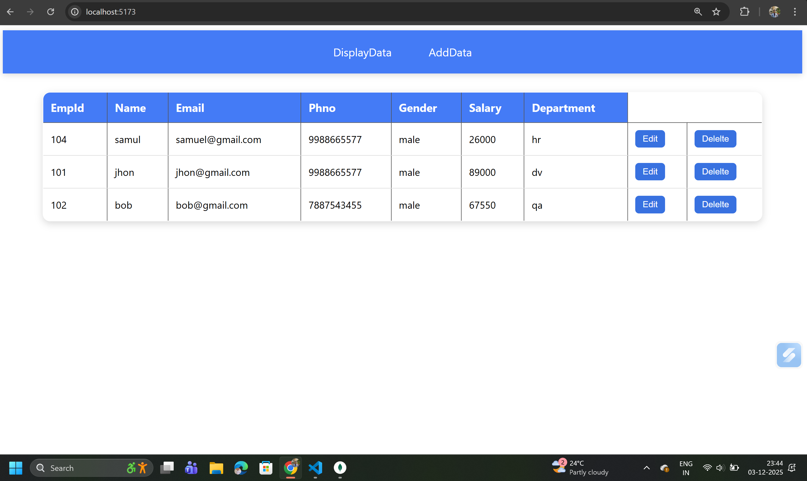

## 📘 Employee Management System (MERN CRUD)

A simple Employee Management System built using React (frontend) and Node.js + Express + MongoDB (backend).


##### This app supports:

✔ Add Employee
✔ Display Employees
✔ Edit Employee
✔ Delete Employee

---

## 🛠️ Tech Stack

<p align="left"> <!-- React -->  <!-- Node -->  <!-- Express -->  <!-- MongoDB -->  <!-- Axios -->  <!-- License -->  <!-- Status -->  </p>

---

### 📸 Project Preview



---

### 🚀 Features

###### ✅ Add Employee

Users can enter:

- Employee ID

- Name

- Email

- Phone Number

- Gender

- Salary

- Department

###### ✅ View All Employees

- Clean, modern UI table display

- Edit and Delete buttons

- Auto refresh after update/delete

###### ✅ Edit Employee

- Pre-filled form with existing data

- Update employee information in database

###### ✅ Delete Employee

- Safe confirmation popup

- Deletes using Employee ID

| Method | Endpoint  | Description        |
| ------ | --------- | ------------------ |
| GET    | /disp     | Get all employees  |
| POST   | /add      | Add new employee   |
| GET    | /edit/:id | Get employee by id |
| PUT    | /upd/:id  | Update employee    |
| DELETE | /del/:id  | Delete employee    |

---

```bash
📦 Installation & Setup
1️⃣ Clone the Repository
git clone --no-checkout https://github.com/Saadnaikwade1/MERN.git
cd MERN
git sparse-checkout init --cone
git sparse-checkout set EmployeeData


2️⃣ Setup Backend
cd Backend
npm install

Start server:
node index.js

Runs on → http://localhost:5000

3️⃣ Setup Frontend
cd Frontend
npm install
npm run dev


Runs on → http://localhost:3000

```

---

💡 Built with ❤️ by [Saad A. Naikwade](https://github.com/Saadnaikwade1)

- 💼 MERN Stack Developer
- 📧 naikwadesaad@gmail.com
- 🌐 LinkedIn | GitHub
